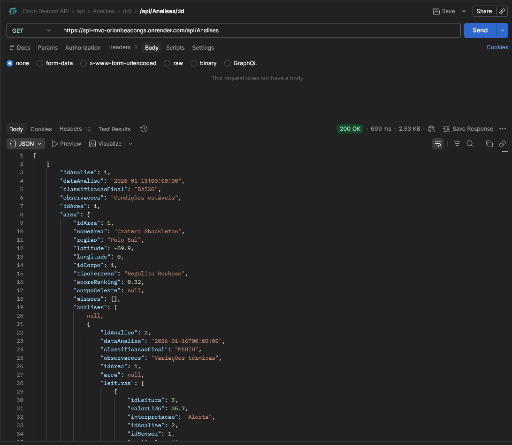
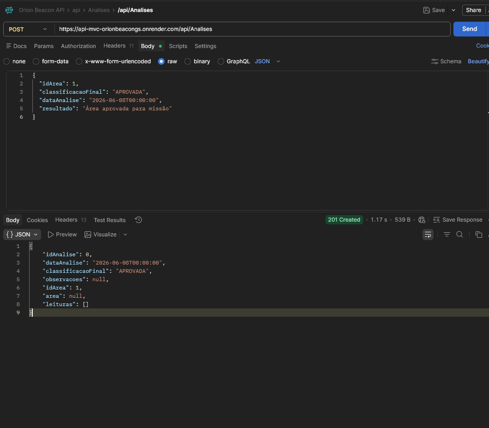
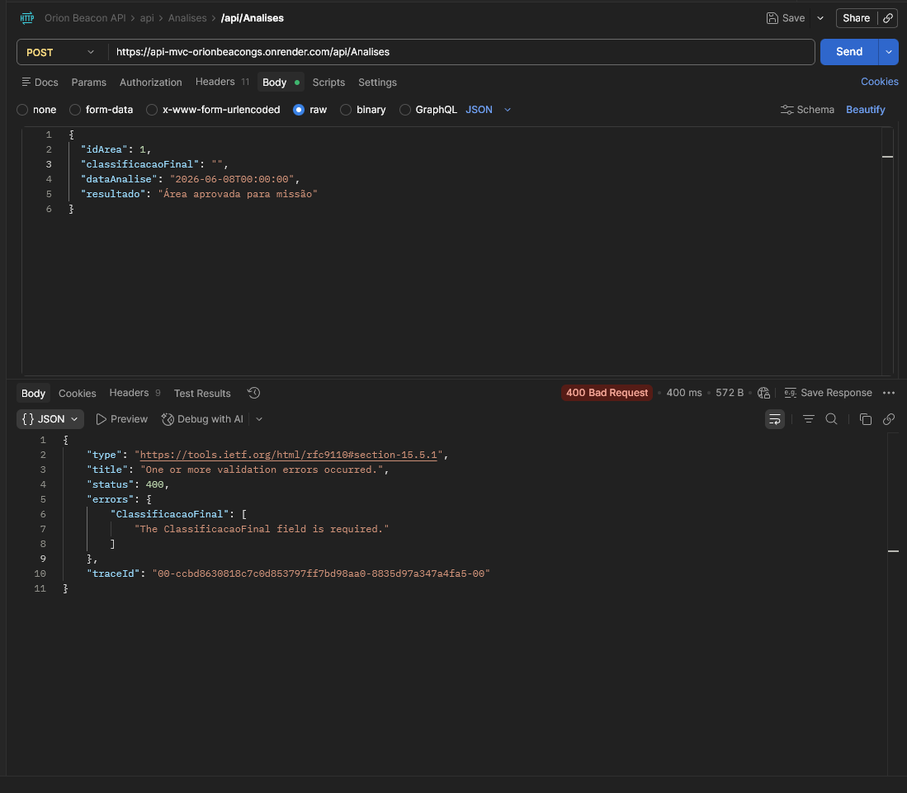

#  Orion Beacon — API MVC

API REST desenvolvida em **ASP.NET Core (.NET 10)** com padrão **MVC**, para gerenciamento de missões espaciais, análises de áreas celestes e leituras de sensores. Utiliza **Oracle Database** via Entity Framework Core e expõe documentação interativa via **Swagger**.

🔗 **Deploy:** [api-mvc-orionbeacongs.onrender.com](https://api-mvc-orionbeacongs.onrender.com)  
📖 **Swagger:** [api-mvc-orionbeacongs.onrender.com/swagger](https://api-mvc-orionbeacongs.onrender.com/swagger)

---

##  Tecnologias

| Tecnologia | Versão |
|---|---|
| .NET | 10.0 |
| ASP.NET Core MVC / Razor Pages | 10.0 |
| Entity Framework Core | 10.0.8 |
| Oracle.EntityFrameworkCore | 10.23.26200 |
| Swashbuckle (Swagger) | 7.2.0 |

---

##  Estrutura do Projeto

```
Proj_OrionBeacon/
├── Controllers/
│   └── Api/                    # Controllers da API REST
│       ├── AnalisesController.cs
│       ├── AreasAnalisadasController.cs
│       ├── CorposCelestesController.cs
│       ├── LeiturasSensorController.cs
│       ├── LogsAnaliseController.cs
│       ├── MissoesController.cs
│       ├── NosqlAreasJsonController.cs
│       └── SensoresController.cs
├── Dados/
│   └── AppDbContext.cs         # Contexto do Entity Framework
├── Migrations/                 # Migrações do banco de dados
├── Models/                     # Entidades do domínio
│   ├── Analise.cs
│   ├── AreaAnalisada.cs
│   ├── CorpoCeleste.cs
│   ├── LeituraSensor.cs
│   ├── LogAnalise.cs
│   ├── Missao.cs
│   ├── NosqlAreaJson.cs
│   └── Sensor.cs
├── Views/                      # Views Razor (interface web)
│   └── AreasEspaciais/
├── wwwroot/                    # Arquivos estáticos
├── Dockerfile
├── appsettings.json
└── Program.cs
```

---

##  Modelo de Dados

| Tabela Oracle | Descrição |
|---|---|
| `TB_CORPO_CELESTE` | Corpos celestes (planetas, luas, asteroides) |
| `TB_AREA_ANALISADA` | Áreas dentro de um corpo celeste (lat/lon, tipo de terreno, score) |
| `TB_MISSAO` | Missões vinculadas a uma área analisada |
| `TB_SENSOR` | Sensores disponíveis para coleta de dados |
| `TB_ANALISE` | Análises realizadas em uma área (classificação final) |
| `TB_LEITURA_SENSOR` | Leituras coletadas por sensores durante uma análise |
| `TB_LOG_ANALISE` | Logs de eventos das análises |
| `TB_NOSQL_AREA_JSON` | Documentos JSON armazenados via Oracle (simulação NoSQL) |

---

##  Endpoints da API

Todos os endpoints seguem o padrão RESTful com CRUD completo:

| Método | Rota | Descrição |
|---|---|---|
| GET | `/api/corposcelestes` | Lista todos os corpos celestes |
| GET | `/api/corposcelestes/{id}` | Busca corpo celeste por ID |
| POST | `/api/corposcelestes` | Cria novo corpo celeste |
| PUT | `/api/corposcelestes/{id}` | Atualiza corpo celeste |
| DELETE | `/api/corposcelestes/{id}` | Remove corpo celeste |
| GET | `/api/areasanalisadas` | Lista todas as áreas analisadas |
| GET | `/api/missoes` | Lista todas as missões |
| GET | `/api/missoes/total` | Retorna total de missões |
| GET | `/api/analises` | Lista todas as análises |
| GET | `/api/sensores` | Lista todos os sensores |
| GET | `/api/leiturassensor` | Lista leituras de sensores |
| GET | `/api/logsanalise` | Lista logs de análise |
| GET | `/api/nosqlareasjson` | Lista documentos JSON (NoSQL) |

> Acesse o [Swagger](https://api-mvc-orionbeacongs.onrender.com/swagger) para a documentação interativa completa.

---

##  Configuração Local

### Pré-requisitos

- [.NET 10 SDK](https://dotnet.microsoft.com/download)
- Banco de dados **Oracle** acessível

### String de Conexão

Configure o arquivo `appsettings.json`:

```json
{
  "ConnectionStrings": {
    "OracleConnection": "User Id=SEU_USUARIO;Password=SUA_SENHA;Data Source=SEU_HOST:1521/SEU_SERVICE;"
  }
}
```

### Executar localmente

```bash
git clone https://github.com/EnzoXc07/API_MVC_ORIONBEACONGS.git
cd API_MVC_ORIONBEACONGS
dotnet restore
dotnet ef database update
dotnet run
```
## 🧪 Testes da API

Os testes foram realizados via **Postman** utilizando a collection importada do OpenAPI Spec (`/swagger/v1/swagger.json`).

### GET /api/Analises — 200 OK

Listagem completa das análises com dados aninhados de área, corpo celeste e leituras de sensor.



---

### POST /api/Analises — 201 Created

Criação bem-sucedida de uma análise enviando apenas os campos necessários (sem objetos aninhados).

**Body enviado:**
```json
{
  "idArea": 1,
  "classificacaoFinal": "APROVADA",
  "dataAnalise": "2026-06-08T00:00:00",
  "resultado": "Área aprovada para missão"
}
```



---

### POST /api/Analises — 400 Bad Request (campo vazio)

Validação correta quando `classificacaoFinal` é enviado como string vazia.



---

## 👤 Autors

**EnzoXc07** — [GitHub](https://github.com/EnzoXc07)  -RM:563379

**Permagnani** [GitHub](https://github.com/Permagnani)

**juliamenezesf** [GitHub](https://github.com/juliamenezesf)

**MatheusGianolli**[GitHub](https://github.com/MatheusGianolli)

**larimagalh**[GitHub](https://github.com/larimagalh)
